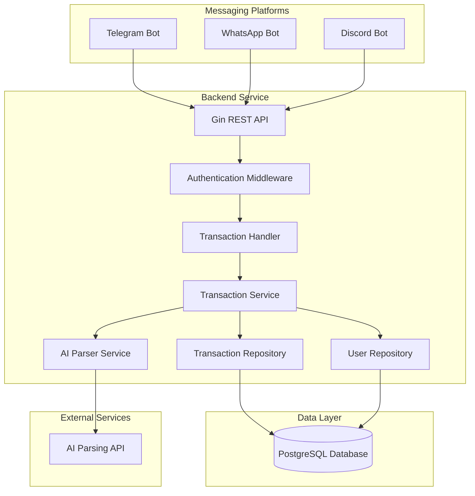

# Design Document

## Overview

The expense tracking bot backend is a Go-based REST API service that processes financial transaction messages from multiple messaging platforms (Telegram, WhatsApp, Discord). The system uses Gin as the web framework, GORM for database operations with PostgreSQL, and integrates with an AI service to parse natural language commands into structured transaction data.

The architecture follows a clean, layered approach with clear separation of concerns between API handlers, business logic, data access, and external service integration.

## Architecture



## Components and Interfaces

### 1. API Layer (Gin Framework)

**Main Server (`main.go`)**
- Initializes Gin router with middleware
- Sets up database connection
- Configures routes and starts server

**Middleware Components:**
- Authentication middleware for bot request validation
- Logging middleware for request/response tracking
- Error handling middleware for consistent error responses
- CORS middleware for cross-origin requests

**Route Handlers (`handlers/transaction_handler.go`)**
```go
type TransactionHandler struct {
    transactionService *services.TransactionService
}

func (h *TransactionHandler) CreateTransaction(c *gin.Context) {
    // Handle POST /api/transactions
}

func (h *TransactionHandler) GetTransactions(c *gin.Context) {
    // Handle GET /api/transactions
}
```

### 2. Service Layer

**Transaction Service (`services/transaction_service.go`)**
```go
type TransactionService struct {
    transactionRepo *repositories.TransactionRepository
    userRepo        *repositories.UserRepository
    aiParser        *services.AIParserService
}

func (s *TransactionService) ProcessBotMessage(userID, platform, message string) (*models.Transaction, error)
func (s *TransactionService) GetUserTransactions(userID string, limit, offset int) ([]*models.Transaction, error)
```

**AI Parser Service (`services/ai_parser_service.go`)**
```go
type AIParserService struct {
    apiEndpoint string
    apiKey      string
}

type ParsedTransaction struct {
    Category string  `json:"category"`
    Name     string  `json:"name"`
    Value    float64 `json:"value"`
    Type     string  `json:"type"` // "income" or "outcome"
}

func (s *AIParserService) ParseMessage(message string) (*ParsedTransaction, error)
```

### 3. Repository Layer (GORM)

**Transaction Repository (`repositories/transaction_repository.go`)**
```go
type TransactionRepository struct {
    db *gorm.DB
}

func (r *TransactionRepository) Create(transaction *models.Transaction) error
func (r *TransactionRepository) GetByUserID(userID string, limit, offset int) ([]*models.Transaction, error)
func (r *TransactionRepository) GetByID(id uint) (*models.Transaction, error)
```

**User Repository (`repositories/user_repository.go`)**
```go
type UserRepository struct {
    db *gorm.DB
}

func (r *UserRepository) Create(user *models.User) error
func (r *UserRepository) GetByPlatformID(platformID, platform string) (*models.User, error)
func (r *UserRepository) GetByID(id uint) (*models.User, error)
```

### 4. Configuration Management

**Config Structure (`config/config.go`)**
```go
type Config struct {
    Server   ServerConfig   `yaml:"server"`
    Database DatabaseConfig `yaml:"database"`
    AI       AIConfig       `yaml:"ai"`
}

type ServerConfig struct {
    Port string `yaml:"port"`
    Host string `yaml:"host"`
}

type DatabaseConfig struct {
    Host     string `yaml:"host"`
    Port     int    `yaml:"port"`
    User     string `yaml:"user"`
    Password string `yaml:"password"`
    DBName   string `yaml:"dbname"`
    SSLMode  string `yaml:"sslmode"`
}

type AIConfig struct {
    Endpoint string `yaml:"endpoint"`
    APIKey   string `yaml:"api_key"`
}
```

## Data Models

### User Model (`models/user.go`)
```go
type User struct {
    ID          uint      `gorm:"primaryKey" json:"id"`
    PlatformID  string    `gorm:"not null;index" json:"platform_id"`
    Platform    string    `gorm:"not null" json:"platform"` // "telegram", "whatsapp", "discord"
    Username    string    `json:"username"`
    CreatedAt   time.Time `json:"created_at"`
    UpdatedAt   time.Time `json:"updated_at"`
    
    Transactions []Transaction `gorm:"foreignKey:UserID" json:"transactions,omitempty"`
}
```

### Transaction Model (`models/transaction.go`)
```go
type Transaction struct {
    ID          uint      `gorm:"primaryKey" json:"id"`
    UserID      uint      `gorm:"not null;index" json:"user_id"`
    Category    string    `gorm:"not null" json:"category"`
    Name        string    `gorm:"not null" json:"name"`
    Value       float64   `gorm:"not null" json:"value"`
    Type        string    `gorm:"not null" json:"type"` // "income" or "outcome"
    RawMessage  string    `json:"raw_message"`
    CreatedAt   time.Time `json:"created_at"`
    UpdatedAt   time.Time `json:"updated_at"`
    
    User User `gorm:"foreignKey:UserID" json:"user,omitempty"`
}
```

### Bot Message Request Model (`models/bot_request.go`)
```go
type BotMessageRequest struct {
    UserID   string `json:"user_id" binding:"required"`
    Platform string `json:"platform" binding:"required,oneof=telegram whatsapp discord"`
    Message  string `json:"message" binding:"required"`
    Username string `json:"username,omitempty"`
}
```

## Error Handling

### Error Types (`utils/errors.go`)
```go
type AppError struct {
    Code    string `json:"code"`
    Message string `json:"message"`
    Details string `json:"details,omitempty"`
}

var (
    ErrInvalidRequest   = &AppError{Code: "INVALID_REQUEST", Message: "Invalid request format"}
    ErrUserNotFound     = &AppError{Code: "USER_NOT_FOUND", Message: "User not found"}
    ErrParsingFailed    = &AppError{Code: "PARSING_FAILED", Message: "Failed to parse message"}
    ErrDatabaseError    = &AppError{Code: "DATABASE_ERROR", Message: "Database operation failed"}
    ErrAIServiceError   = &AppError{Code: "AI_SERVICE_ERROR", Message: "AI service unavailable"}
)
```

### Error Response Format
```json
{
    "error": {
        "code": "PARSING_FAILED",
        "message": "Failed to parse message",
        "details": "Unable to extract transaction information from the provided message"
    }
}
```

## Testing Strategy

### Unit Testing
- **Repository Layer**: Test GORM operations with test database
- **Service Layer**: Mock dependencies and test business logic
- **Handler Layer**: Test HTTP endpoints with test requests
- **AI Parser**: Mock AI service responses for consistent testing

### Integration Testing
- **Database Integration**: Test with real PostgreSQL instance
- **API Integration**: End-to-end API testing with test data
- **AI Service Integration**: Test with actual AI service (with fallback mocks)

### Test Structure
```
tests/
├── unit/
│   ├── repositories/
│   ├── services/
│   └── handlers/
├── integration/
│   ├── api/
│   └── database/
└── fixtures/
    ├── users.json
    └── transactions.json
```

### Testing Tools
- **Testing Framework**: Go's built-in testing package
- **Assertions**: Testify library for better assertions
- **Database Testing**: In-memory SQLite for unit tests, PostgreSQL for integration
- **HTTP Testing**: Gin's testing utilities and httptest package
- **Mocking**: Mockery for generating mocks from interfaces

## API Endpoints

### Transaction Endpoints
```
POST /api/transactions
- Create transaction from bot message
- Request: BotMessageRequest
- Response: Transaction or Error

GET /api/transactions?user_id={id}&limit={n}&offset={n}
- Get user transactions with pagination
- Response: []Transaction or Error

GET /api/transactions/{id}
- Get specific transaction
- Response: Transaction or Error
```

### Health Check
```
GET /health
- System health check
- Response: {"status": "ok", "timestamp": "2024-01-01T00:00:00Z"}
```

## Database Schema

### Users Table
```sql
CREATE TABLE users (
    id SERIAL PRIMARY KEY,
    platform_id VARCHAR(255) NOT NULL,
    platform VARCHAR(50) NOT NULL,
    username VARCHAR(255),
    created_at TIMESTAMP DEFAULT CURRENT_TIMESTAMP,
    updated_at TIMESTAMP DEFAULT CURRENT_TIMESTAMP
);

CREATE INDEX idx_users_platform_id ON users(platform_id);
CREATE UNIQUE INDEX idx_users_platform_user ON users(platform_id, platform);
```

### Transactions Table
```sql
CREATE TABLE transactions (
    id SERIAL PRIMARY KEY,
    user_id INTEGER NOT NULL REFERENCES users(id),
    category VARCHAR(255) NOT NULL,
    name VARCHAR(255) NOT NULL,
    value DECIMAL(15,2) NOT NULL,
    type VARCHAR(10) NOT NULL CHECK (type IN ('income', 'outcome')),
    raw_message TEXT,
    created_at TIMESTAMP DEFAULT CURRENT_TIMESTAMP,
    updated_at TIMESTAMP DEFAULT CURRENT_TIMESTAMP
);

CREATE INDEX idx_transactions_user_id ON transactions(user_id);
CREATE INDEX idx_transactions_created_at ON transactions(created_at);
```